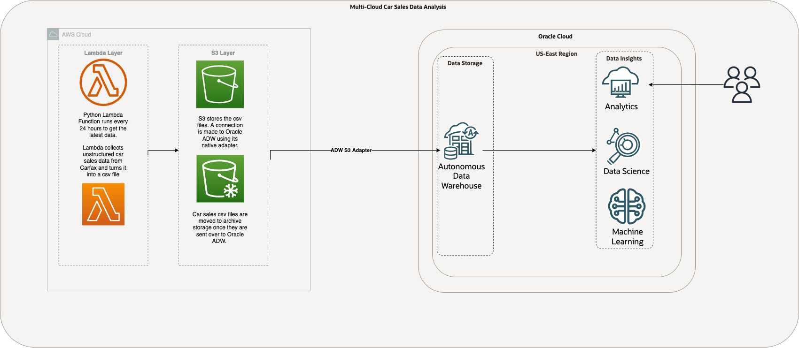

# Multi-Cloud-Car-Analysis
Using AWS Lambda, S3 and Oracle Autonomous Data Warehouse, Oracle Machine Learning and Oracle Analytics Cloud, we scrape carfax data and analyze sales trends.

## Motivation
With the cloud revolution in full swing, cloud vendors are coming up impressive solutions everyday. In this project we will see how to utilize AWS and Oracle Cloud and some of their best offerings. Many organizations have realized that it is not feasible to rely on one cloud service to achieve all of their infrastructure needs, especially true for larger and cloud native companies. 

Reason I chose to scrape CarFax is because I am planning on buying a car in the next year and want to track the market, more so with the recent uptick in the used car prices.
## Architecture

## AWS Resources We Need 

### AWS Lambda
AWS Lambda is Amazon's serverless compute service that runs code without allocating any underlying compute resources. In this project, we will utilize Lambda to run our CarFax scraper written in Python. 

### Amazon S3
Amazon S3 is Amazon's object storage solution that is infinetly scalable. We will create a trigger between Lambda and S3 to store our data.

## Oracle Cloud Resources We Need

### Autonomous Data Warehouse

### Oracle Analytics Cloud

## Making the Connection between AWS S3 and Oracle Autonomous Data Warehouse

## Using Oracle Analytics Cloud
